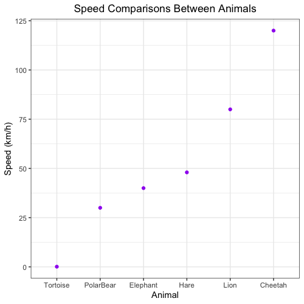

# Day 4 Activities

1. Change the `animals` data frame to a tibble called `animals_tb`. Save the row names to a column called `animal_names` before turning it into a tibble.

	

  	
	

2. Use ggplot2 to plot the animal names (x-axis) versus the speed of the animal (y-axis) in `animals_tb` using a scatterplot. Customize the plot to display as shown below.

	

  	
	

3. We decide that our plot would look better with the animal names ordered from slowest to fastest. Using the `animals_tb` data frame, reorder the animals on the x-axis to start with the slowest animal on the left-hand side of the plot to the fastest animal on the right-hand side of the plot by completing the following steps:

	**a.** Extract the `speed` column as a vector.
	
	**b.** Determine the indices for how to reorder the values of the `speed` vector to go from the slowest animal to the fastest animal using the `order()` function. 

	**c.** Extract the row names of the `animals` data frame as a vector of animal names.
	
	**d.** Use to the indices for how to reorder the values of the `speed` column to reorder the animal names so that they go from the slowest to the fastest animal, and save to a variable called `names_ordered_by_speed`.
	
	**e.** Turn the `animal_names` column into a factor and specify the levels as the animal names in order from slowest to fastest (output in part d).
	
	**f.** Re-plot the scatterplot with the animal names in order from slowest to fastest.
	
	

  	
	

	
4. Save the plot as a PDF called `animals_by_speed_scatterplot.pdf ` to the results folder.

5. Use the functions from the `dplyr` package to perform the following tasks:

	**a.** Extract the rows of `animals_tb` tibble with color of grey or tan, order the rows based from slowest to fastest speed, and save to a variable called `animals_gray_tan`.
	
	**b.** Save `animals_gray_tan` as a comma-separated value file.
	
	

  	
	
	
	
