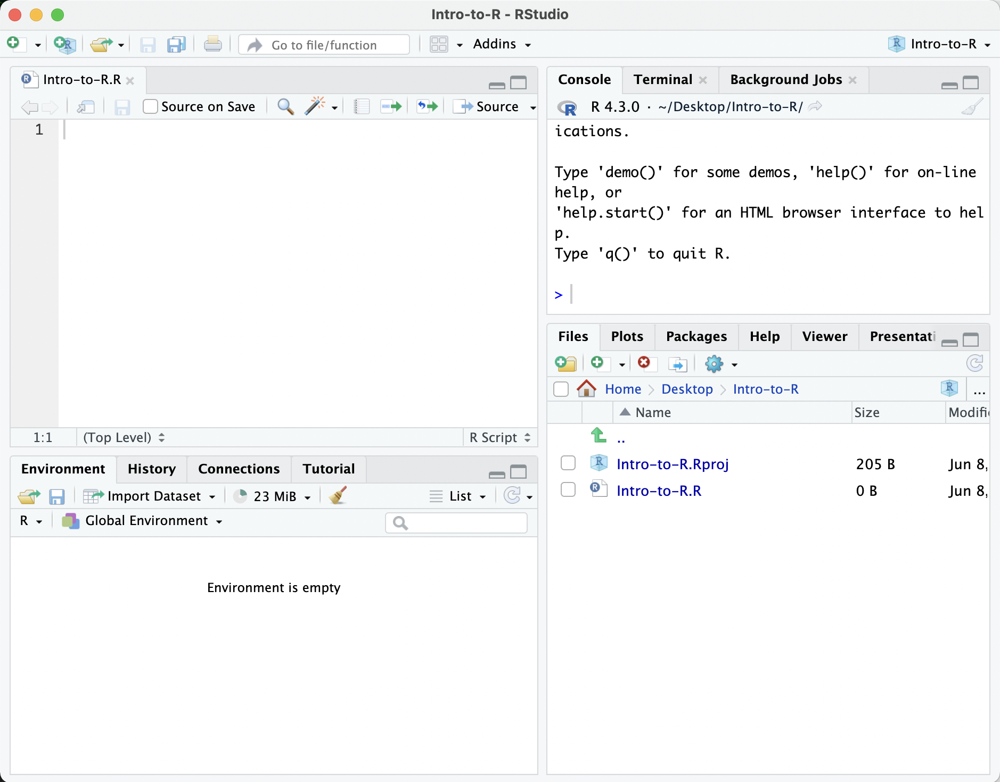

Approximate time: 45 minutes

## Learning Objectives

* Describe what R and RStudio are.
* Interact with R using RStudio.
* Familiarize various components of RStudio.
* Employ variables in R.

## What is R?

The common misconception is that R is a programming language but in fact it is much more than that. Think of R as an environment for statistical computing and graphics, which brings together a number of features to provide powerful functionality.

The R environment combines:

* effective handling of big data 
* collection of integrated tools
* graphical facilities
* simple and effective programming language


## Why use R?


R is a powerful, extensible environment. It has a wide range of statistics and general data analysis and visualization capabilities.

* Data handling, wrangling, and storage
* Wide array of statistical methods and graphical techniques available
* Easy to install on any platform and use (and it’s free!)
* Open source with a large and growing community of peers

#### Examples of R used in the media and science
* *"At the BBC data team, we have developed an R package and an R cookbook to make the process of creating publication-ready graphics in our in-house style..."* - [BBC Visual and Data Journalism cookbook for R graphics](https://bbc.github.io/rcookbook/)
* *"R package of data and code behind the stories and interactives at FiveThirtyEight.com, a data-driven journalism website founded by Nate Silver (initially began as a polling aggregation site, but now covers politics, sports, science and pop culture) and owned by ESPN..."* - [fivethirtyeight Package](https://cran.r-project.org/web/packages/fivethirtyeight/vignettes/fivethirtyeight.html)
* [Single Cell RNA-seq Data analysis with Seurat](https://satijalab.org/seurat/)

## What is RStudio?

RStudio is freely available open-source Integrated Development Environment (IDE). RStudio provides an environment with many features to make using R easier and is a great alternative to working on R in the terminal. 


* Graphical user interface, not just a command prompt
* Great learning tool 
* Free for academic use
* Platform agnostic
* Open source


## Creating a new project directory in RStudio

Let's create a new project directory for our "Introduction to R" lesson today. 

1. Open RStudio
2. Go to the `File` menu and select `New Project`.
3. In the `New Project` window, choose `New Directory`. Then, choose `New Project`. Name your new directory `Intro-to-R` and then "Create the project as subdirectory of:" the Desktop (or location of your choice).
4. Click on `Create Project`.

<p align="center">

</p>

5. After your project is completed, if the project does not automatically open in RStudio, then go to the `File` menu, select `Open Project`, and choose `Intro-to-R.Rproj`.
6. When RStudio opens, you will see three panels in the window.
7. Go to the `File` menu and select `New File`, and select `R Script`. 
8. Go to the `File` mena and select `Save As...`, type `Intro-to-R.R` and select `Save`

<p align="center">

</p>

The RStudio interface should now look like the screenshot below.



### What is a project in RStudio?

It is simply a directory that contains everything related your analyses for a specific project. RStudio projects are useful when you are working on context- specific analyses and you wish to keep them separate. When creating a project in RStudio you associate it with a working directory of your choice (either an existing one, or a new one). A `. RProj file` is created within that directory and that keeps track of your command history and variables in the environment. The `. RProj file` can be used to open the project in its current state but at a later date.

When a project is **(re) opened** within RStudio the following actions are taken:
 
* A new R session (process) is started
* The .RData file in the project's main directory is loaded, populating the environment with any objects that were present when the project was closed. 
* The .Rhistory file in the project's main directory is loaded into the RStudio History pane (and used for Console Up/Down arrow command history).
* The current working directory is set to the project directory.
* Previously edited source documents are restored into editor tabs
* Other RStudio settings (e.g. active tabs, splitter positions, etc.) are restored to where they were the last time the project was closed.

*Information adapted from [RStudio Support Site](https://support.rstudio.com/hc/en-us/articles/200526207-Using-Projects)*

## RStudio Interface

**The RStudio interface has four main panels:**

1. **Console**: where you can type commands and see output. *The console is all you would see if you ran R in the command line without RStudio.*
2. **Script editor**: where you can type out commands and save to file. You can also submit the commands to run in the console.
3. **Environment/History**: environment shows all active objects and history keeps track of all commands run in console
4. **Files/Plots/Packages/Help**

## Organizing your working directory & setting up

### Viewing your working directory

Before we organize our working directory, let's check to see where our current working directory is located by typing into the console:

```r
getwd()
```

Your working directory should be the `Intro-to-R` folder constructed when you created the project. The working directory is where RStudio will automatically look for any files you bring in and where it will automatically save any files you create, unless otherwise specified. 

You can visualize your working directory by selecting the `Files` tab from the **Files/Plots/Packages/Help** window. 

<p align="center">

</p>

If you wanted to choose a different directory to be your working directory, you could navigate to a different folder in the `Files` tab, then, click on the `More` dropdown menu and select `Set As Working Directory`.
 
<p align="center">

</p>


### Structuring your working directory
To organize your working directory for a particular analysis, you should separate the original data (raw data) from intermediate datasets. For instance, you may want to create a `data/` directory within your working directory that stores the raw data, and have a `results/` directory for intermediate datasets and a `figures/` directory for the plots you will generate.

<p align="center">

</p>

Let's create these three directories within your working directory by clicking on `New Folder` within the `Files` tab. 

When finished, your working directory should look like:


### Setting up 

This is more of a housekeeping task. We will be writing long lines of code in our script editor and want to make sure that the lines "wrap" and you don't have to scroll back and forth to look at your long line of code.

Click on "Tools" at the top of your RStudio screen and click on "Global Options" in the pull down menu.

On the left, select "Code" and put a check against "Soft-wrap R source files". Make sure you click the "Apply" button at the bottom of the Window before saying "OK".

<p align="center">

</p>

## Interacting with R

Now that we have our interface and directory structure set up, let's start playing with R! There are **two main ways** of interacting with R in RStudio: using the **console** or by using **script editor** (plain text files that contain your code).

### Console window
The **console window** (in RStudio, the bottom left panel) is the place where R is waiting for you to tell it what to do, and where it will show the results of a command.  You can type commands directly into the console, but they will be forgotten when you close the session. 

Let's test it out:

```r
3 + 5
```


### Script editor

Best practice is to enter the commands in the **script editor**, and save the script. You are encouraged to comment liberally to describe the commands you are running using `#`. This way, you have a complete record of what you did, you can easily show others how you did it and you can do it again later on if needed. 

**The Rstudio script editor allows you to 'send' the current line or the currently highlighted text to the R console by clicking on the `Run` button in the upper-right hand corner of the script editor**. 

Now let's try entering commands to the **script editor** and using the comments character `#` to add descriptions and highlighting the text to run:
	
	# Intro to R Lesson
	# Feb 16th, 2016

	# Interacting with R
	
	## I am adding 3 and 5. R is fun!
	3+5

<p align="center">

</p>

Alternatively, you can run by simply pressing the `Ctrl` and `Return/Enter` keys at the same time as a shortcut.

<p align="center">

</p>

You should see the command run in the console and output the result.


	
What happens if we do that same command without the comment symbol `#`? Re-run the command after removing the # sign in the front:

```r
I am adding 3 and 5. R is fun!
3+5
```

Now R is trying to run that sentence as a command, and it 
doesn't work. We get an error in the console *"Error: unexpected symbol in "I am" means that the R interpreter did not know what to do with that command."*


### Console command prompt

Interpreting the command prompt can help understand when R is ready to accept commands. Below lists the different states of the command prompt and how you can exit a command:

**Console is ready to accept commands**: `>`.

If R is ready to accept commands, the R console shows a `>` prompt. 

When the console receives a command (by directly typing into the console or running from the script editor (`Ctrl-Enter`), R will try to execute it.

After running, the console will show the results and come back with a new `>` prompt to wait for new commands.


**Console is waiting for you to enter more data**: `+`.

If R is still waiting for you to enter more data because it isn't complete yet,
the console will show a `+` prompt. It means that you haven't finished entering
a complete command. Often this can be due to you having not 'closed' a parenthesis or quotation. 

**Escaping a command and getting a new prompt**: `esc`

If you're in Rstudio and you can't figure out why your command isn't running, you can click inside the console window and press `esc` to escape the command and bring back a new prompt `>`.

### Keyboard shortcuts in RStudio
In addition to some of the shortcuts described earlier in this lesson, we have listed a few more that can be helpful as you work in RStudio.

| key              | action                 |
| ---------------- | ---------------------- |
| <kbd>Ctrl</kbd>+<kbd>Enter</kbd>     | Run command from script editor in console |
| <kbd>ESC</kbd> | Escape the current command to return to the command prompt          |
| <kbd>Ctrl</kbd>+<kbd>1</kbd>      | Move cursor from console to script editor        |
| <kbd>Ctrl</kbd>+<kbd>2</kbd>     | Move cursor from script editor to console |
| <kbd>Tab</kbd>     | Use this key to complete a file path       |
| <kbd>Ctrl</kbd>+<kbd>Shift</kbd>+<kbd>C</kbd>     | Comment the block of highlighted text               |

***
**Exercise**

1. Try highlighting only `3 +` from your script editor and running it. Find a way to bring back the command prompt `>` in the console.

***

## The R syntax
Now that we know how to talk with R via the script editor or the console, we want to use R for something more than adding numbers. To do this, we need to know more about the R syntax. 


The main "parts of speech" in R (syntax) include:

  - the **comments** `#` and how they are used to document function and its content
  - **variables** and **functions**
  - the **assignment operator** `<-`
  - the `=` for **arguments** in functions

_NOTE: indentation and consistency in spacing is used to improve clarity and legibility_

We will go through each of these "parts of speech" in more detail, starting with the assignment operator.

## Assignment operator

To do useful and interesting things in R, we need to assign _values_ to
_variables_ using the assignment operator, `<-`.  For example, we can use the assignment operator to assign the value of `3` to `x` by executing:

```r
x <- 3
```

The assignment operator (`<-`) assigns **values on the right** to **variables on the left**. 

*In RStudio, typing `Alt + -` (push `Alt` at the same time as the `-` key, on Mac type `option + -`) will write ` <- ` in a single keystroke.*


## Variables

A variable is a symbolic name for (or reference to) information. Variables in computer programming are analogous to "buckets", where information can be maintained and referenced. On the outside of the bucket is a name. When referring to the bucket, we use the name of the bucket, not the data stored in the bucket.

In the example above, we created a variable or a 'bucket' called `x`. Inside we put a value, `3`. 

Let's create another variable called `y` and give it a value of 5. 

```r
y <- 5
```

When assigning a value to an variable, R does not print anything to the console. You can force to print the value by using parentheses or by typing the variable name.

```
y
```

You can also view information on the variable by looking in your `Environment` window in the upper right-hand corner of the RStudio interface.


Now we can reference these buckets by name to perform mathematical operations on the values contained within. What do you get in the console for the following operation: 

```r
x + y
```

Try assigning the results of this operation to another variable called `number`. 

```r
number <- x + y
```

***
**Exercises**

1. Try changing the value of the variable `x` to 5. What happens to `number`?
2. Now try changing the value of variable `y` to contain the value 10. What do you need to do, to update the variable `number`?

***

### Tips on variable names
Variables can be given almost any name, such as `x`, `current_temperature`, or
`subject_id`. However, there are some rules / suggestions you should keep in mind:

- Make your names explicit and not too long.
- Avoid names starting with a number (`2x` is not valid but `x2` is)
- Avoid names of fundamental functions in R (e.g., `if`, `else`, `for`, see [here](https://statisticsglobe.com/r-functions-list/) for a complete list). In general, even if it's allowed, it's best to not use other function names (e.g., `c`, `T`, `mean`, `data`) as variable names. When in doubt
check the help to see if the name is already in use. 
- Avoid dots (`.`) within a variable name as in `my.dataset`. There are many functions
in R with dots in their names for historical reasons, but because dots have a
special meaning in R (for methods) and other programming languages, it's best to
avoid them. 
- Use nouns for object names and verbs for function names
- Keep in mind that **R is case sensitive** (e.g., `genome_length` is different from `Genome_length`)
- Be consistent with the styling of your code (where you put spaces, how you name variable, etc.). In R, two popular style guides are [Hadley Wickham's style guide](http://adv-r.had.co.nz/Style.html) and [Google's](http://web.stanford.edu/class/cs109l/unrestricted/resources/google-style.html).


## Interacting with data in R

R is commonly used for handling big data, and so it only makes sense that we learn about R in the context of some kind of relevant data. Let's take a few minutes to add files to the folders we created and familiarize ourselves with the data.

### Adding files to your working directory

You can access the files we need for this workshop using the links provided below. If you right click on the link, and "Save link as..". Choose `~/Desktop/Intro-to-R/data` as the destination of the file. You should now see the file appear in your working directory. **We will discuss these files a bit later in the lesson.**

* Download the **normalized counts file** by right clicking on [this link](https://raw.githubusercontent.com/hbc/NGS_Data_Analysis_Course/master/sessionII/data/counts.rpkm.csv)
* Download **metadata file** using [this link](https://github.com/hbc/NGS_Data_Analysis_Course/raw/master/sessionII/data/mouse_exp_design.csv)
* Download the **functional analysis output file** using [this link](https://github.com/hbctraining/Training-modules/blob/master/Tidyverse_ggplot2/data/gprofiler_results_Mov10oe.csv?raw=true) 

> *NOTE:* If the files download automatically to some other location on your laptop, you can move them to the your working directory using your file explorer or finder (outside RStudio), or navigating to the files in the `Files` tab of the bottom right panel of RStudio

### The dataset

In this example dataset, we have collected whole brain samples from 12 mice and want to evaluate expression differences between them. The expression data represents normalized count data obtained from RNA-sequencing of the 12 brain samples. This data is stored in a comma separated values (CSV) file as a 2-dimensional matrix, with **each row corresponding to a gene and each column corresponding to a sample**.

 

### The metadata
We have another file in which we identify **information about the data** or **metadata**. Our metadata is also stored in a CSV file. In this file, each row corresponds to a sample and each column contains some information about each sample. 

The first column contains the row names, and **note that these are identical to the column names in our expression data file above** (albeit, in a slightly different order). The next few columns contain information about our samples that allow us to categorize them. For example, the second column contains genotype information for each sample. Each sample is classified in one of two categories: Wt (wild type) or KO (knockout). *What types of categories do you observe in the remaining columns?*

 

R is particularly good at handling this type of **categorical data**. Rather than simply storing this information as text, the data is represented in a specific data structure which allows the user to sort and manipulate the data in a quick and efficient manner. We will discuss this in more detail as we go through the different lessons in R!  

### The functional analysis results

We will be using the results of the functional analysis to learn about packages/functions from the [Tidyverse suite of integrated packages](https://www.tidyverse.org/packages/). These packages are designed to work together to make common data science operations like data wrangling, tidying, reading/writing, parsing, and visualizing, more user-friendly. 

## Best practices

Before we move on to more complex concepts and getting familiar with the language, we want to point out a few things about best practices when working with R which will help you stay organized in the long run:

* Code and workflow are more reproducible if we can document everything that we do. Our end goal is not just to "do stuff", but to do it in a way that anyone can easily and exactly replicate our workflow and results. **All code should be written in the script editor and saved to file, rather than working in the console.** 
* The **R console** should be mainly used to inspect objects, test a function or get help. 
* Use `#` signs to comment. **Comment liberally** in your R scripts. This will help future you and other collaborators know what each line of code (or code block) was meant to do. Anything to the right of a `#` is ignored by R. *A shortcut for this is <kbd>Ctrl</kbd>+<kbd>Shift</kbd>+<kbd>C</kbd> if you want to comment an entire chunk of text.*

---

*This lesson has been developed by members of the teaching team at the [Harvard Chan Bioinformatics Core (HBC)](http://bioinformatics.sph.harvard.edu/). These are open access materials distributed under the terms of the [Creative Commons Attribution license](https://creativecommons.org/licenses/by/4.0/) (CC BY 4.0), which permits unrestricted use, distribution, and reproduction in any medium, provided the original author and source are credited.*

* *The materials used in this lesson are adapted from work that is Copyright © Data Carpentry (http://datacarpentry.org/). 
All Data Carpentry instructional material is made available under the [Creative Commons Attribution license](https://creativecommons.org/licenses/by/4.0/) (CC BY 4.0).*

